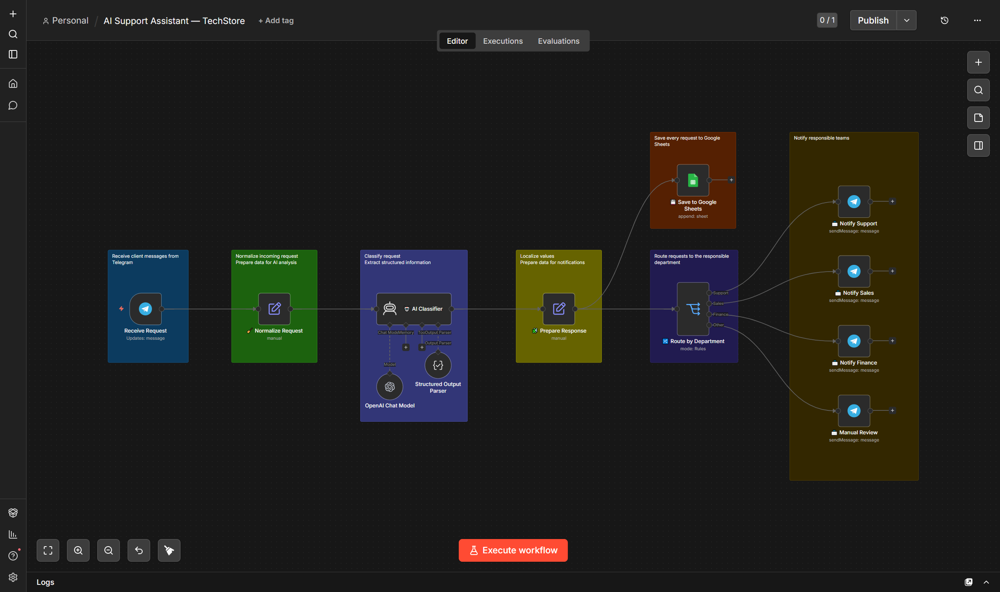

# AI Support Assistant



AI-powered customer support automation workflow built with n8n.

## Business Problem

Customer support teams often spend significant time manually reading, categorizing, and forwarding incoming requests.
This slows down response time, increases the risk of routing errors, and makes it harder to track customer issues consistently.

## Overview

This workflow automatically analyzes incoming customer requests, classifies them using AI, stores every request in Google Sheets, and routes notifications to the appropriate department.

## Architecture workflow

```text
Telegram
   ↓
Normalize Request
   ↓
AI Classification
   ↓
Prepare Response
   ↓
Save to Google Sheets
   ↓
Department Router
      ├─ Support
      ├─ Sales
      ├─ Finance
      └─ Manual Review
```

## Demo

### Example Input

Customer:

Hi! Where is my order #23232? It was supposed to arrive yesterday.


### AI Classification

| Field | Value |
|------|------|
| Department | Support |
| Priority | Medium |
| Topic | order_status |
| Order Number | 23232 |

### Automated Actions

- Save request to Google Sheets
- Send notification to Support team via Telegram
- Store structured request data

## Features

- Receive customer requests from Telegram
- AI classification using OpenAI
- Structured JSON output
- Automatic department routing
- Priority detection
- Order number extraction
- Google Sheets logging
- Telegram notifications
- Manual review for unknown requests

## Tech Stack

- n8n
- OpenAI API
- AI Agent
- Structured Output Parser
- Telegram Bot API
- Google Sheets API
- JSON

## Key Skills Demonstrated

- AI-powered text classification
- Structured JSON extraction
- Workflow architecture in n8n
- Business process automation
- Department routing logic
- Telegram Bot integration
- Google Sheets integration
- Prompt engineering


## Repository Structure

```text
.
├── README.md
├── workflow.png
├── LICENSE
└── workflow
    └── AI Support Assistant — TechStore.json
```

## Future Improvements

- Email support integration
- CRM integration (HubSpot / Pipedrive)
- Automatic AI-generated replies
- SLA monitoring
- Analytics dashboard
- Multi-language support
- Customer sentiment analysis

## Author

Alexander Zaytsev
