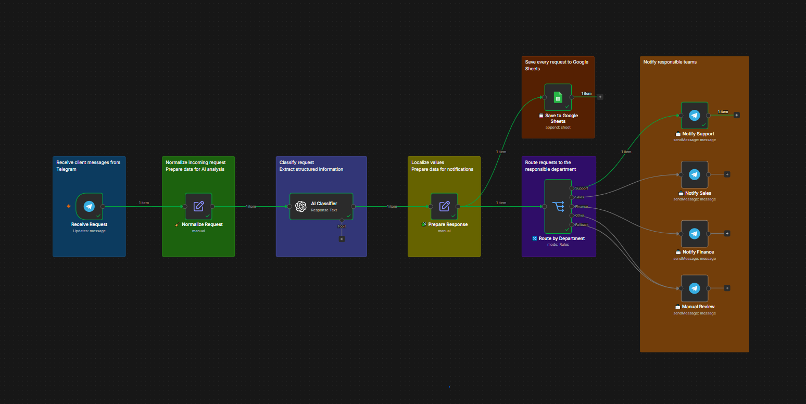

# AI Support Assistant

[English version](README.md)

AI-система классификации и маршрутизации клиентских обращений, созданная в n8n. Workflow получает сообщения из Telegram, извлекает структурированные данные с помощью OpenAI, сохраняет каждый запрос в Google Sheets и уведомляет ответственный отдел.

---

## Бизнес-задача

Сотрудники поддержки тратят много времени на ручное чтение, классификацию и перенаправление входящих обращений.

Это замедляет ответы, увеличивает риск неправильной маршрутизации и усложняет ведение общей истории клиентских запросов.

Workflow автоматически классифицирует обращения и направляет сомнительные случаи менеджеру на ручную проверку.

---

## Архитектура Workflow

```text
Telegram Trigger
      ↓
Нормализация запроса
      ↓
AI Classifier + строгая JSON Schema
      ↓
Подготовка результата
      ├── Сохранение в Google Sheets
      └── Маршрутизация по отделам
              ├── Поддержка → Telegram
              ├── Продажи → Telegram
              ├── Финансы → Telegram
              ├── Другое → Ручная проверка
              └── Fallback → Ручная проверка
```

---

## Workflow



---

## Архитектурные принципы

* AI анализирует обращение, классифицирует его и извлекает структурированные данные.
* Строгая JSON Schema контролирует типы полей, допустимые значения и наличие обязательных полей.
* Итоговую маршрутизацию выполняет детерминированный Router.
* Каждый входящий запрос сохраняется в Google Sheets независимо от выбранного отдела.
* `Prepare Response` добавляет русские названия отдела, приоритета и темы для удобства менеджеров.
* Неизвестные или неподдерживаемые значения направляются на ручную проверку через fallback.
* AI Agent намеренно не используется, потому что модель не выбирает инструменты и не определяет последовательность действий.

---

## Структурированный результат AI

Классификатор всегда возвращает пять полей:

```json
{
  "department": "support",
  "priority": "high",
  "topic": "order_status",
  "order_number": "23232",
  "description": "Клиент запрашивает статус просроченного заказа."
}
```

Допустимые значения:

* `department`: `support`, `sales`, `finance`, `other`
* `priority`: `low`, `medium`, `high`
* `topic`: `order_status`, `delivery`, `payment`, `refund`, `account`, `warranty`, `product`, `pricing`, `technical_issue`, `other`

---

## Технологический стек

| Технология             | Назначение                                     |
| ---------------------- | ---------------------------------------------- |
| n8n                    | Автоматизация workflow и маршрутизация         |
| Telegram Bot API       | Получение запросов и уведомление отделов       |
| OpenAI API             | Классификация обращений и извлечение данных    |
| JSON Schema            | Строгая проверка структурированного результата |
| Google Sheets API      | Общий журнал входящих запросов                 |
| JavaScript Expressions | Преобразование и локализация данных            |

---

## Импорт и настройка

Публичный экспорт workflow не содержит credentials, Telegram chat ID и идентификатор Google Sheets.

1. Импортируйте `ai-support-assistant-workflow.json` в n8n.
2. Настройте Telegram credentials в ноде `Receive Request`.
3. Настройте OpenAI credentials в ноде `AI Classifier`.
4. Создайте Google-таблицу со следующими колонками:

   * `received_at`
   * `source`
   * `customer_name`
   * `customer_contact`
   * `department`
   * `priority`
   * `topic`
   * `message`
   * `order_number`
   * `description`
5. Настройте Google Sheets credentials и выберите нужную таблицу.
6. Замените placeholders в Telegram-нодах:

   * `YOUR_SUPPORT_CHAT_ID`
   * `YOUR_SALES_CHAT_ID`
   * `YOUR_FINANCE_CHAT_ID`
   * `YOUR_MANUAL_REVIEW_CHAT_ID`
7. Проверьте workflow на нескольких типах обращений.
8. После успешного тестирования активируйте workflow.

---

## Основные возможности

* Получение обращений из Telegram
* Нормализация входящих данных
* AI-классификация обращений
* Строгий структурированный результат
* Определение ответственного отдела
* Определение приоритета
* Определение темы обращения
* Извлечение номера заказа
* Русские названия полей для менеджеров
* Общий журнал обращений в Google Sheets
* Детерминированная маршрутизация
* Telegram-уведомления для отделов
* Ручная проверка и fallback

---

## Бизнес-правила

* Вопросы до покупки о товарах, наличии, ценах и доставке направляются в отдел продаж.
* Вопросы о существующем заказе, гарантии, аккаунте и технических проблемах направляются в поддержку.
* Вопросы об оплате, возвратах, чеках и двойном списании направляются в финансовый отдел.
* Неясные и неподдерживаемые обращения направляются на ручную проверку.
* Если в обращении указан номер заказа, AI извлекает его.
* Если номер заказа отсутствует, возвращается пустая строка.
* AI не отвечает клиенту напрямую.
* AI подготавливает структурированные данные, а решение о маршрутизации принимает workflow.
* Каждый запрос сохраняется в Google Sheets независимо от дальнейшего маршрута.

---

## Проверенный сценарий

Пример обращения:

```text
Здравствуйте! Где мой заказ 23232? Он должен был прийти вчера.
```

Результат:

* Отдел: Поддержка
* Приоритет: Высокий
* Тема: Статус заказа
* Номер заказа: 23232
* Запрос сохранён в Google Sheets.
* Отдел поддержки получил уведомление в Telegram.

---

## Возможные улучшения

* Интеграция с CRM
* Контроль SLA
* Отслеживание статусов обращений
* Интеграция с базой знаний
* Подготовка черновиков ответов с помощью AI
* Аналитический дашборд
* Поддержка нескольких языков

---

## Автор

Alexander Zaytsev

AI Automation Engineer

* GitHub: https://github.com/AlexZaytsev-ai
* Email: [polonix315@gmail.com](mailto:polonix315@gmail.com)
